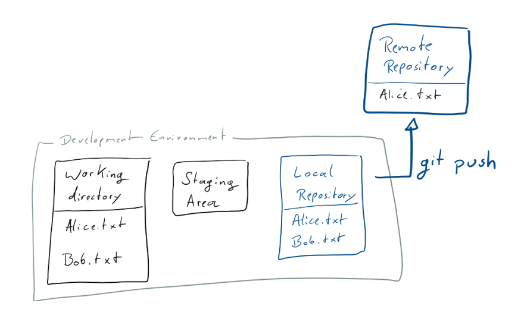

## GIT CHEATSHEET



#### 1. When you want to push a locally residing code to your remote repo:
`git init` create the local repository  
`git add filename` or `git add .` to add all the files in the pwd to the staging area  
`git commit -m "Commit message"` commit changes to your local repository  
`git remote add origin  <REMOTE_URL>` point to your github (or any other remote) repo  
`git push -u origin master` this command pushes your changes to your remote repo  

* `git log` see all the commits that were made for our project  

* `git status` shows the state of the working directory and the staging area; which changes have been staged, which haven't, and which files aren't being tracked by Git  

* `git branch <new-branch-name>` creates a new branch  
  `git branch` lists the current branches for your project  
  
* `git checkout` is a local operation that only operates on data that's already fetched  
  `git checkout <commit-hash>` go back to a previous state of your project code that you committed  
  `git checkout <branch-name>` switches to a different branch  
  `git checkout -b ＜new-branch＞` create the new branch and immediately switch to it  
  
  **Git Checkout a Remote Branch**: first fetch the contents of the branch  
  ```git
  git fetch --all  
  git checkout ＜remotebranch＞
  ```
